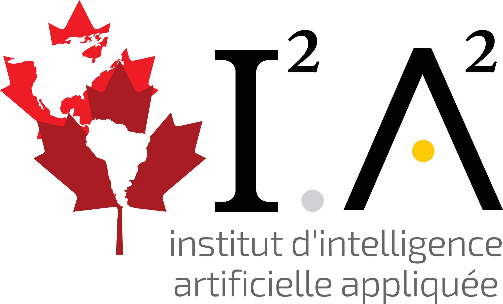
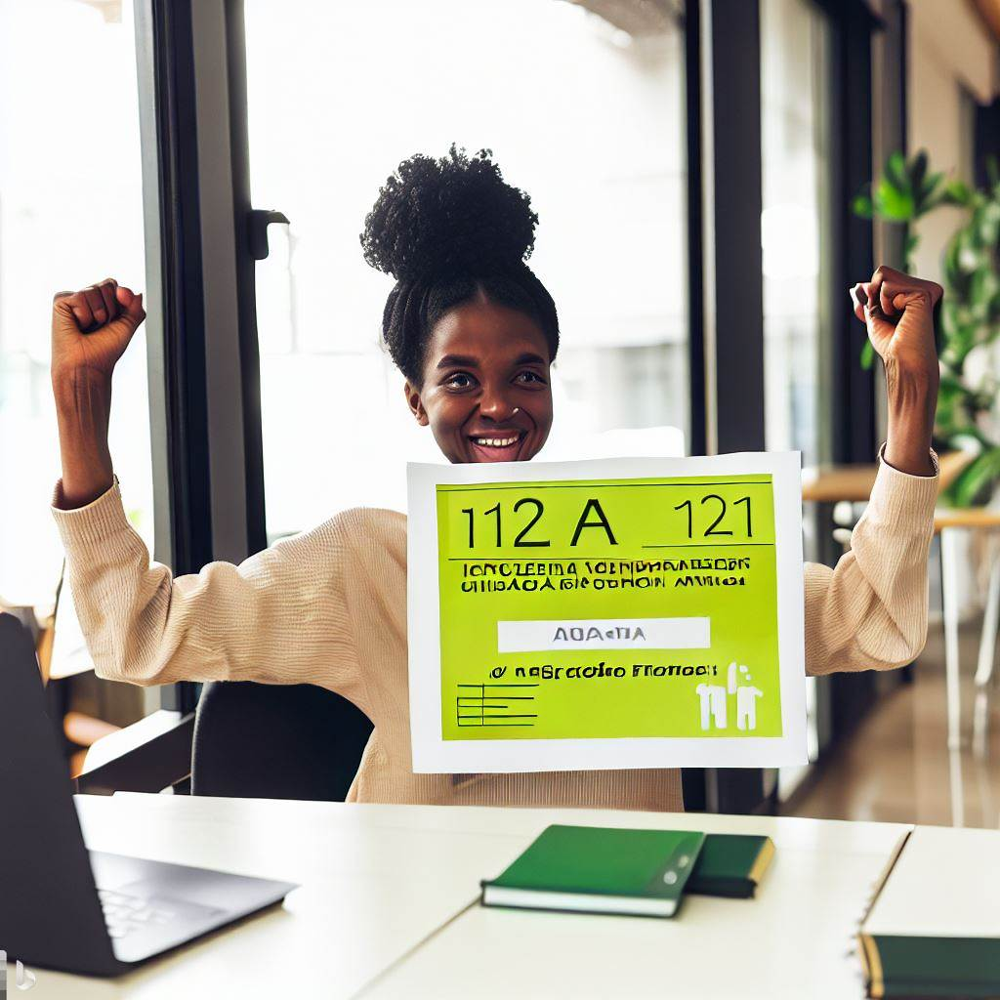

# Campanha de Marketing para o Lançamento da Plataforma do I2A2

Este projeto consiste em uma campanha de marketing para o lançamento da plataforma do I2A2 (Institut d'Intelligence Artificielle Appliquée), uma instituição especializada em oferecer cursos e capacitação na área de Inteligência Artificial. A campanha tem como objetivo atrair pessoas interessadas em inteligência artificial, principalmente aquelas que estão em transição de carreira ou que desejam ampliar suas capacidades profissionais.

&nbsp;
## Resumo do Site

O site possui uma página inicial que destaca a marca do I2A2, com um banner atraente e uma chamada para ação que convida os visitantes a iniciarem suas jornadas na área de IA. Além disso, o site apresenta os motivos pelos quais os interessados devem escolher o I2A2 para aprimorar seus conhecimentos, bem como depoimentos de alunos satisfeitos com os cursos oferecidos.

Uma seção é dedicada aos cursos em destaque, listando alguns dos principais cursos oferecidos pela instituição. Outra seção destaca os parceiros do I2A2, com logotipos de empresas fictícias representando empresas reais que são parceiras da instituição.

Por fim, o site exibe histórias de sucesso de alunos que obtiveram êxito após concluírem os cursos do I2A2, mostrando o impacto positivo da instituição na vida profissional das pessoas.

&nbsp;
## Histórico da Conversa

- **Prompt 1**
preciso que me ajude a criar uma webpage para um campanha de marketing para o lançamento da plataforma do I2A2, Institut d'Intelligence Artificielle Appliquée, o foco dessa campanha é atrair pessoas que estão interessadas por inteligência artificial, que estejam em transição de carreira ou queiram ampliar sua capacidade profissional

- **Resposta 1**
Você está buscando ajuda para criar uma página da web para uma campanha de marketing para o lançamento da plataforma do I2A2, um instituto especializado em inteligência artificial. O objetivo da campanha é atrair pessoas interessadas em IA, especialmente aquelas que estão em transição de carreira ou desejam expandir suas habilidades profissionais. Posso ajudar com isso!

&nbsp;
- **Prompt 2**
crie os arquivos html, css e js para essa página

- **Resposta 2**
Aqui estão os arquivos HTML, CSS e JS para a página da campanha de marketing do I2A2. Você pode usar esses arquivos como base para começar a construir o site.
<details>
  <summary>HTML</summary>

```
<!DOCTYPE html>
<html lang="en">

<head>
    <meta charset="UTF-8">
    <meta name="viewport" content="width=device-width, initial-scale=1.0">
    <title>I2A2 - Campanha de Marketing</title>
    <link rel="stylesheet" href="styles.css">
</head>

<body>
    <!-- Cabeçalho da Página -->
    <header>
        <div class="logo">
            <!-- Coloque aqui o logotipo do I2A2 -->
            
        </div>
        <nav>
            <a href="#">Login</a>
            <!-- Coloque aqui o link para a página de cadastro -->
            <a href="#">Cadastre-se</a>
        </nav>
    </header>

    <!-- Banner Principal -->
    <section class="banner">
        <h1>I2A2 - Institut d'Intelligence Artificielle Appliquée</h1>
        <p>Amplie suas habilidades em Inteligência Artificial e conquiste novas oportunidades profissionais.</p>
        <!-- Coloque aqui a chamada de ação (call-to-action) -->
        <a href="#" class="cta-button">Inicie sua jornada na IA agora!</a>
    </section>

    <!-- Seção "Por que escolher o I2A2?" -->
    <section class="why-choose">
        <h2>Por que escolher o I2A2?</h2>
        <ul>
            <li>Cursos práticos e aplicados no mercado de trabalho.</li>
            <li>Professores especialistas em Inteligência Artificial.</li>
            <li>Aprendizado flexível e adaptado ao seu ritmo.</li>
            <li>Parcerias com empresas líderes na área de IA.</li>
        </ul>
        <!-- Coloque aqui alguns depoimentos de alunos ou profissionais -->
        <div class="testimonials">
            <blockquote>
                "Graças aos cursos do I2A2, consegui transicionar minha carreira e hoje trabalho com IA em uma empresa de tecnologia."
                <cite>João Silva</cite>
            </blockquote>
        </div>
    </section>

    <!-- Seção de Cursos e Conteúdo -->
    <section class="courses">
        <h2>Nossos Cursos em Destaque</h2>
        <!-- Coloque aqui uma lista de cursos oferecidos -->
        <ul>
            <li>
                <h3>Curso de Introdução à Inteligência Artificial</h3>
                <p>Aprenda os conceitos básicos da IA e suas aplicações práticas.</p>
                <a href="#" class="cta-button">Saiba mais</a>
            </li>
            <li>
                <h3>Curso Avançado de Machine Learning</h3>
                <p>Domine as técnicas de Machine Learning e crie modelos preditivos.</p>
                <a href="#" class="cta-button">Saiba mais</a>
            </li>
            <!-- Adicione mais cursos aqui -->
        </ul>
    </section>

    <!-- Seção de Parceiros ou Empresas Associadas -->
    <section class="partners">
        <h2>Nossos Parceiros</h2>
        <!-- Coloque aqui os logotipos dos parceiros ou empresas associadas -->
        <div class="partner-logos">
            
            
            <!-- Adicione mais logotipos aqui -->
        </div>
    </section>

    <!-- Seção "Histórias de Sucesso" -->
    <section class="success-stories">
        <h2>Histórias de Sucesso</h2>
        <!-- Coloque aqui algumas histórias de sucesso -->
        <div class="success-story">
            
            <p>"Graças ao I2A2, consegui um novo emprego na área de IA e estou adorando minha nova carreira!"</p>
            <cite>Maria Santos</cite>
        </div>
        <!-- Adicione mais histórias de sucesso aqui -->
    </section>

    <!-- Rodapé -->
    <footer>
        <p>&copy; 2023 I2A2 - Institut d'Intelligence Artificielle Appliquée. Todos os direitos reservados.</p>
        <!-- Coloque aqui informações de contato, links para redes sociais, etc. -->
    </footer>

    <script src="script.js"></script>
</body>

</html>
```
</details>

<details>
  <summary>CSS</summary>

```
/* Estilos globais */
body {
    font-family: Arial, sans-serif;
    line-height: 1.6;
    margin: 0;
    padding: 0;
}

header {
    background-color: #333;
    color: #fff;
    padding: 1rem;
    display: flex;
    justify-content: space-between;
    align-items: center;
}

header a {
    color: #fff;
    text-decoration: none;
    margin-left: 1rem;
}

.banner {
    text-align: center;
    padding: 3rem 0;
    background-color: #f9f9f9;
}

.banner h1 {
    font-size: 2.5rem;
}

.cta-button {
    display: inline-block;
    background-color: #333;
    color: #fff;
    padding: 1rem 2rem;
    text-decoration: none;
    margin-top: 1rem;
}

.cta-button:hover {
    background-color: #555;
}

.why-choose {
    padding: 2rem 0;
}

.why-choose h2 {
    text-align: center;
}

.why-choose ul {
    list-style: none;
    padding: 0;
}

.why-choose li {
    margin-bottom: 1rem;
}

.testimonials blockquote {
    margin: 2rem 0;
    padding: 1rem;
    border-left: 3px solid #333;
}

.testimonials cite {
    font-weight: bold;
}

.courses {
    padding: 2rem 0;
}

.courses h2 {
    text-align: center;
}

.courses ul {
    list-style: none;
    padding: 0;
    display: grid;
    grid-template-columns: repeat(auto-fit, minmax(300px, 1fr));
    grid-gap: 1rem;
}

.courses li {
    padding: 1rem;
    border: 1px solid #ddd;
    border-radius: 5px;
}

.courses h3 {
    font-size: 1.5rem;
    margin-bottom: 1rem;
}

.partners {
    text-align: center;
    padding: 2rem 0;
    background-color: #f9f9f9;
}

.partners h2 {
    margin-bottom: 1rem;
}

.partner-logos {
    display: flex;
    justify-content: center;
    align-items: center;
}

.partner-logos img {
    max-width: 100px;
    margin: 0 1rem;
}

.success-stories {
    padding: 2rem 0;
}

.success-stories h2 {
    text-align: center;
    margin-bottom: 1rem;
}

.success-story {
    text-align: center;
    margin-bottom: 2rem;
}

.success-story img {
    max-width: 200px;
    border-radius: 50%;
    margin-bottom: 1rem;
}

footer {
    background-color: #333;
    color: #fff;
    text-align: center;
    padding: 1rem;
}

/* Estilos para dispositivos menores (celulares e tablets) */
@media screen and (max-width: 768px) {
    .banner h1 {
        font-size: 2rem;
    }

    .cta-button {
        font-size: 0.9rem;
    }
}

```
</details>

&nbsp;
- **Prompt 3**
preciso limitar o tamanho das imagens para não ficarem muito grandes

- **Resposta 3**
Claro! Vou adicionar os atributos de tamanho nas imagens para limitar o seu tamanho e garantir que não fiquem muito grandes. Assim, elas serão exibidas de forma adequada na página.
<details>
  <summary>HTML</summary>

```
<!-- Banner Principal -->
<section class="banner">
    <h1>I2A2 - Institut d'Intelligence Artificielle Appliquée</h1>
    <p>Amplie suas habilidades em Inteligência Artificial e conquiste novas oportunidades profissionais.</p>
    <!-- Coloque aqui a chamada de ação (call-to-action) -->
    <a href="#" class="cta-button">Inicie sua jornada na IA agora!</a>
    <!-- Adicione o atributo width para limitar o tamanho da imagem do banner -->
    
</section>

<!-- Seção de Parceiros ou Empresas Associadas -->
<section class="partners">
    <h2>Nossos Parceiros</h2>
    <!-- Coloque aqui os logotipos dos parceiros ou empresas associadas -->
    <div class="partner-logos">
        <!-- Adicione o atributo width para limitar o tamanho das imagens dos parceiros -->
        
        
        <!-- Adicione mais logotipos aqui -->
    </div>
</section>

<!-- Seção "Histórias de Sucesso" -->
<section class="success-stories">
    <h2>Histórias de Sucesso</h2>
    <!-- Coloque aqui algumas histórias de sucesso -->
    <div class="success-story">
        <!-- Adicione o atributo width para limitar o tamanho da imagem da história de sucesso -->
        
        <p>"Graças ao I2A2, consegui um novo emprego na área de IA e estou adorando minha nova carreira!"</p>
        <cite>Maria Santos</cite>
    </div>
    <!-- Adicione mais histórias de sucesso aqui -->
</section>
```
</details>

&nbsp;
- **Prompt 4**
atualize o código que enviou no começo, adicionando os atributos de tamanho nas imagens

- **Resposta 4**
Aqui está o código atualizado com os atributos de tamanho nas imagens para limitar o seu tamanho e garantir que elas não fiquem muito grandes na página.
<details>
  <summary>HTML</summary>

```
<!DOCTYPE html>
<html lang="en">

<head>
    <meta charset="UTF-8">
    <meta name="viewport" content="width=device-width, initial-scale=1.0">
    <title>I2A2 - Campanha de Marketing</title>
    <link rel="stylesheet" href="styles.css">
</head>

<body>
    <!-- Cabeçalho da Página -->
    <header>
        <div class="logo">
            <!-- Coloque aqui o logotipo do I2A2 -->
            
        </div>
        <nav>
            <a href="#">Login</a>
            <!-- Coloque aqui o link para a página de cadastro -->
            <a href="#">Cadastre-se</a>
        </nav>
    </header>

    <!-- Banner Principal -->
    <section class="banner">
        <h1>I2A2 - Institut d'Intelligence Artificielle Appliquée</h1>
        <p>Amplie suas habilidades em Inteligência Artificial e conquiste novas oportunidades profissionais.</p>
        <!-- Coloque aqui a chamada de ação (call-to-action) -->
        <a href="#" class="cta-button">Inicie sua jornada na IA agora!</a>
        <!-- Adicione o atributo width para limitar o tamanho da imagem do banner -->
        
    </section>

    <!-- Seção "Por que escolher o I2A2?" -->
    <section class="why-choose">
        <h2>Por que escolher o I2A2?</h2>
        <ul>
            <li>Cursos práticos e aplicados no mercado de trabalho.</li>
            <li>Professores especialistas em Inteligência Artificial.</li>
            <li>Aprendizado flexível e adaptado ao seu ritmo.</li>
            <li>Parcerias com empresas líderes na área de IA.</li>
        </ul>
        <!-- Coloque aqui alguns depoimentos de alunos ou profissionais -->
        <div class="testimonials">
            <blockquote>
                "Graças aos cursos do I2A2, consegui transicionar minha carreira e hoje trabalho com IA em uma empresa de tecnologia."
                <cite>João Silva</cite>
            </blockquote>
        </div>
    </section>

    <!-- Seção de Cursos e Conteúdo -->
    <section class="courses">
        <h2>Nossos Cursos em Destaque</h2>
        <!-- Coloque aqui uma lista de cursos oferecidos -->
        <ul>
            <li>
                <h3>Curso de Introdução à Inteligência Artificial</h3>
                <p>Aprenda os conceitos básicos da IA e suas aplicações práticas.</p>
                <a href="#" class="cta-button">Saiba mais</a>
            </li>
            <li>
                <h3>Curso Avançado de Machine Learning</h3>
                <p>Domine as técnicas de Machine Learning e crie modelos preditivos.</p>
                <a href="#" class="cta-button">Saiba mais</a>
            </li>
            <!-- Adicione mais cursos aqui -->
        </ul>
    </section>

    <!-- Seção de Parceiros ou Empresas Associadas -->
    <section class="partners">
        <h2>Nossos Parceiros</h2>
        <!-- Coloque aqui os logotipos dos parceiros ou empresas associadas -->
        <div class="partner-logos">
            <!-- Adicione o atributo width para limitar o tamanho das imagens dos parceiros -->
            
            
            <!-- Adicione mais logotipos aqui -->
        </div>
    </section>

    <!-- Seção "Histórias de Sucesso" -->
    <section class="success-stories">
        <h2>Histórias de Sucesso</h2>
        <!-- Coloque aqui algumas histórias de sucesso -->
        <div class="success-story">
            <!-- Adicione o atributo width para limitar o tamanho da imagem da história de sucesso -->
            
            <p>"Graças ao I2A2, consegui um novo emprego na área de IA e estou adorando minha nova carreira!"</p>
            <cite>Maria Santos</cite>
        </div>
        <!-- Adicione mais histórias de sucesso aqui -->
    </section>

    <!-- Rodapé -->
    <footer>
        <p>&copy; 2023 I2A2 - Institut d'Intelligence Artificielle Appliquée. Todos os direitos reservados.</p>
        <!-- Coloque aqui informações de contato, links para redes sociais, etc. -->
    </footer>

    <script src="script.js"></script>
</body>

</html>
```
</details>

&nbsp;
- **Prompt 5**
atualize o css que me enviou para deixar os elementos cinzas em tom de vermelho

- **Resposta 5**
Vou atualizar o CSS que enviei anteriormente para alterar a cor dos elementos de cinza para um tom de vermelho, conforme solicitado.
<details>
  <summary>CSS</summary>

```
/* Estilos globais */
body {
    font-family: Arial, sans-serif;
    line-height: 1.6;
    margin: 0;
    padding: 0;
}

header {
    background-color: #8b0000; /* Vermelho escuro */
    color: #fff;
    padding: 1rem;
    display: flex;
    justify-content: space-between;
    align-items: center;
}

header a {
    color: #fff;
    text-decoration: none;
    margin-left: 1rem;
}

.banner {
    text-align: center;
    padding: 3rem 0;
    background-color: #ffe4e1; /* Tom de vermelho mais claro */
}

.banner h1 {
    font-size: 2.5rem;
}

.cta-button {
    display: inline-block;
    background-color: #8b0000; /* Vermelho escuro */
    color: #fff;
    padding: 1rem 2rem;
    text-decoration: none;
    margin-top: 1rem;
}

.cta-button:hover {
    background-color: #a52a2a; /* Vermelho mais claro quando hover */
}

.why-choose {
    padding: 2rem 0;
}

.why-choose h2 {
    text-align: center;
}

.why-choose ul {
    list-style: none;
    padding: 0;
}

.why-choose li {
    margin-bottom: 1rem;
}

.testimonials blockquote {
    margin: 2rem 0;
    padding: 1rem;
    border-left: 3px solid #8b0000; /* Vermelho escuro */
}

.testimonials cite {
    font-weight: bold;
}

.courses {
    padding: 2rem 0;
}

.courses h2 {
    text-align: center;
}

.courses ul {
    list-style: none;
    padding: 0;
    display: grid;
    grid-template-columns: repeat(auto-fit, minmax(300px, 1fr));
    grid-gap: 1rem;
}

.courses li {
    padding: 1rem;
    border: 1px solid #8b0000; /* Vermelho escuro */
    border-radius: 5px;
}

.courses h3 {
    font-size: 1.5rem;
    margin-bottom: 1rem;
}

.partners {
    text-align: center;
    padding: 2rem 0;
    background-color: #ffe4e1; /* Tom de vermelho mais claro */
}

.partners h2 {
    margin-bottom: 1rem;
}

.partner-logos {
    display: flex;
    justify-content: center;
    align-items: center;
}

.partner-logos img {
    max-width: 100px;
    margin: 0 1rem;
}

.success-stories {
    padding: 2rem 0;
}

.success-stories h2 {
    text-align: center;
    margin-bottom: 1rem;
}

.success-story {
    text-align: center;
    margin-bottom: 2rem;
}

.success-story img {
    max-width: 200px;
    border-radius: 50%;
    margin-bottom: 1rem;
}

footer {
    background-color: #8b0000; /* Vermelho escuro */
    color: #fff;
    text-align: center;
    padding: 1rem;
}

/* Estilos para dispositivos menores (celulares e tablets) */
@media screen and (max-width: 768px) {
    .banner h1 {
        font-size: 2rem;
    }

    .cta-button {
        font-size: 0.9rem;
    }

    /* Estilos para imagens de parceiros em dispositivos menores */
    .partner-logos {
        max-width: 300px; /* Define o tamanho máximo para o contêiner */
        margin: 0 auto; /* Centraliza o contêiner horizontalmente */
    }

    .partner-logos img {
        max-width: 100px;
        margin: 0 10px; /* Adicione margens para espaçar as imagens */
    }
}
```
</details>

&nbsp;
- **Prompt 6**
faça com que apenas o botão "Inicie sua jornada na IA agora!" fique na frente da imagem do banner

- **Resposta 6**
Para que o botão "Inicie sua jornada na IA agora!" fique na frente da imagem do banner, é necessário aplicar uma posição absoluta ao botão e ajustar suas coordenadas. Dessa forma, ele sobreporá a imagem do banner, mantendo-se visível e destacado na página.
<details>
  <summary>HTML</summary>

```
<!-- Banner Principal -->
<section class="banner">
    <h1>I2A2 - Institut d'Intelligence Artificielle Appliquée</h1>
    <p>Amplie suas habilidades em Inteligência Artificial e conquiste novas oportunidades profissionais.</p>
    <!-- Adicione o atributo width para limitar o tamanho da imagem do banner -->
    
    <!-- Mova o botão para dentro do contêiner do banner e adicione a classe "banner-button" -->
    <a href="#" class="cta-button banner-button">Inicie sua jornada na IA agora!</a>
</section>
```
</details>

&nbsp;
- **Prompt 7**
certo, substitua os nomes das empresas fictícias no código html pelos nomes que acabou de criar

- **Resposta 7**
Claro! Vou substituir os nomes das empresas fictícias pelos nomes que criamos anteriormente: "GlobalTrade Solutions" e "TechVolution". Além disso, atualizarei o texto dos motivos para escolher o I2A2 e a recomendação do João da Silva para centralizá-los na página.
<details>
  <summary>HTML</summary>

```
<!DOCTYPE html>
<html lang="en">

<head>
    <meta charset="UTF-8">
    <meta name="viewport" content="width=device-width, initial-scale=1.0">
    <title>I2A2 - Campanha de Marketing</title>
    <link rel="stylesheet" href="styles.css">
</head>

<body>
    <!-- Cabeçalho da Página -->
    <header>
        <div class="logo">
            <!-- Coloque aqui o logotipo do I2A2 -->
            
        </div>
        <nav>
            <a href="#">Login</a>
            <!-- Coloque aqui o link para a página de cadastro -->
            <a href="#">Cadastre-se</a>
        </nav>
    </header>

    <!-- Banner Principal -->
    <section class="banner">
        <h1>I2A2 - Institut d'Intelligence Artificielle Appliquée</h1>
        <p>Amplie suas habilidades em Inteligência Artificial e conquiste novas oportunidades profissionais.</p>
        <!-- Adicione o atributo width para limitar o tamanho da imagem do banner -->
        
        <!-- Mova o botão para dentro do contêiner do banner e adicione a classe "banner-button" -->
        <a href="#" class="cta-button banner-button">Inicie sua jornada na IA agora!</a>
    </section>

    <!-- Seção "Por que escolher o I2A2?" -->
    <section class="why-choose">
        <h2>Por que escolher o I2A2?</h2>
        <!-- Centralize o texto dos motivos -->
        <ul style="text-align: center;">
            <li>Cursos práticos e aplicados no mercado de trabalho.</li>
            <li>Professores especialistas em Inteligência Artificial.</li>
            <li>Aprendizado flexível e adaptado ao seu ritmo.</li>
            <li>Parcerias com empresas líderes na área de IA.</li>
        </ul>
        <!-- Centralize o texto da recomendação -->
        <div class="testimonials">
            <blockquote style="text-align: center;">
                "Graças aos cursos do I2A2, consegui transicionar minha carreira e hoje trabalho com IA em uma empresa de tecnologia."
                <cite>João Silva</cite>
            </blockquote>
        </div>
    </section>

    <!-- Seção de Cursos e Conteúdo -->
    <section class="courses">
        <h2>Nossos Cursos em Destaque</h2>
        <!-- Coloque aqui uma lista de cursos oferecidos -->
        <ul>
            <li>
                <h3>Curso de Introdução à Inteligência Artificial</h3>
                <p>Aprenda os conceitos básicos da IA e suas aplicações práticas.</p>
                <a href="#" class="cta-button">Saiba mais</a>
            </li>
            <li>
                <h3>Curso Avançado de Machine Learning</h3>
                <p>Domine as técnicas de Machine Learning e crie modelos preditivos.</p>
                <a href="#" class="cta-button">Saiba mais</a>
            </li>
            <!-- Adicione mais cursos aqui -->
        </ul>
    </section>

    <!-- Seção de Parceiros ou Empresas Associadas -->
    <section class="partners">
        <h2>Nossos Parceiros</h2>
        <!-- Coloque aqui os logotipos dos parceiros ou empresas associadas -->
        <div class="partner-logos">
            <!-- Adicione o atributo width para limitar o tamanho das imagens dos parceiros -->
            
            <p>GlobalTrade Solutions</p>
            
            <p>TechVolution</p>
            <!-- Adicione mais logotipos aqui -->
        </div>
    </section>

    <!-- Seção "Histórias de Sucesso" -->
    <section class="success-stories">
        <h2>Histórias de Sucesso</h2>
        <!-- Coloque aqui algumas histórias de sucesso -->
        <div class="success-story">
            <!-- Adicione o atributo width para limitar o tamanho da imagem da história de sucesso -->
            
            <p>"Graças ao I2A2, consegui um novo emprego na área de IA e estou adorando minha nova carreira!"</p>
            <cite>Maria Santos</cite>
        </div>
        <!-- Adicione mais histórias de sucesso aqui -->
    </section>

    <!-- Rodapé -->
    <footer>
        <p>&copy; 2023 I2A2 - Institut d'Intelligence Artificielle Appliquée. Todos os direitos reservados.</p>
        <!-- Coloque aqui informações de contato, links para redes sociais, etc. -->
    </footer>

    <script src="script.js"></script>
</body>

</html>
```
</details>

&nbsp;
## Prompts das imagens (utilizando Bing Image Generator)
- **Banner**

banner para site de campanha sobre inteligencia artificial

&nbsp;
- **Partner1**

logo para empresa de tecnologia famosa

&nbsp;
- **Partner2**

logo para grande empresa multinacional do setor comercial

&nbsp;
- **Success1**

pessoa feliz por ter concluído um curso sobre inteligencia artificial na i2a2
